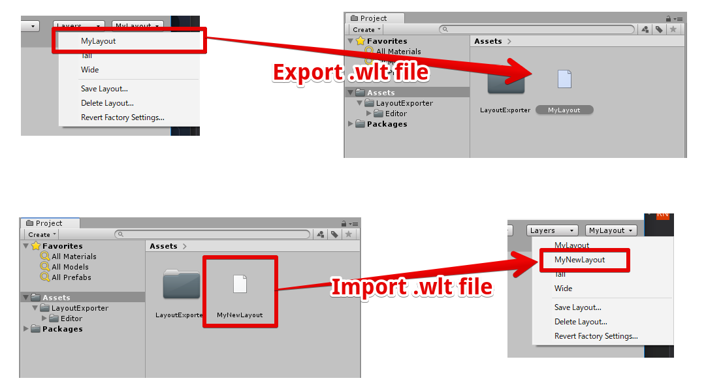
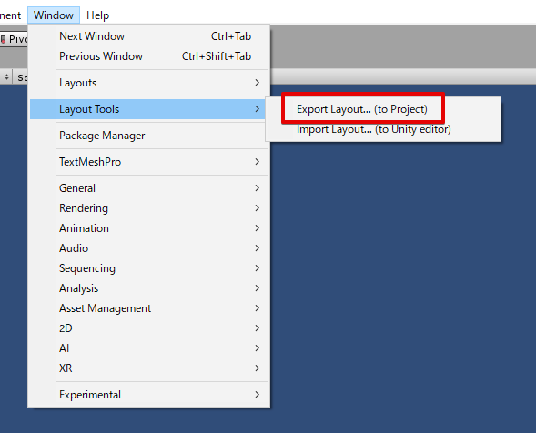
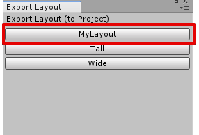
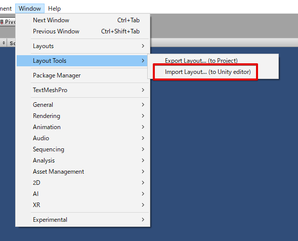
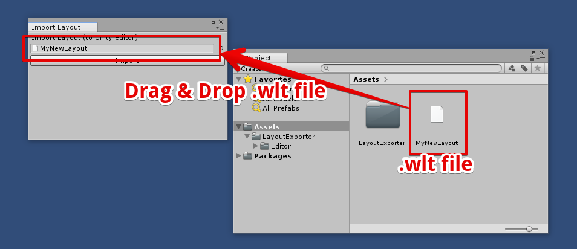
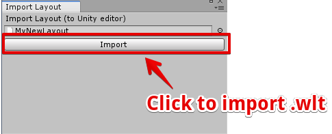

# Unity-LayoutExporter

## Overview
Unity-LayoutExporter is a tool to import/export Unity layout settings(.wlt)

 

## Usage 1 - Export Layout Settings (.wlt)

STEP1 : Select **Window > Layout Tools > Export Layout**. 

 
STEP2 : Select Layout which you want to export. 

 

## Usage 2 - Import Layout Settings (.wlt)
STEP1 : Select **Window > Layout Tools > Import Layout**. 

 

STEP 2: Register .wlt file to window. 

 

STEP 3: Click import button. 

